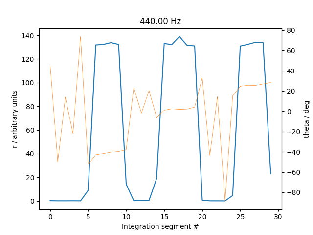
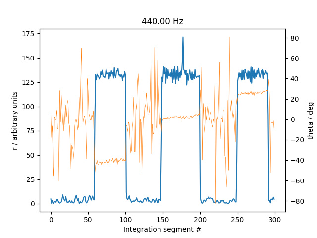

Lock-in amplifier
=================

### Usage

Record a WAV file with the desired duration with `record_cli.py`.

`lock_in_amplifier.py` splits the file into segments of duration `integration_time_s` and performs the lock-in
calculation within each segment, to find the strength of an in-phase signal (in phase within the segment) in the
respective segment.

## Example

Example of a WAV file where a (strong) 440 Hz sound is present for five seconds in three periods. The integration time
is 1 s.

The analysis shows that the sound can be filtered out very well with a lock-in frequency of 440 Hz. Theta angle varies
from period to period – which means the sound is not in phase over the three different periods.

Since the signal is so strong, the integration period can be reduced. Here with 0.1 s.

Note that theta is all over the place when the signal is not strong/detected.

## References

https://en.wikipedia.org/wiki/Lock-in_amplifier
