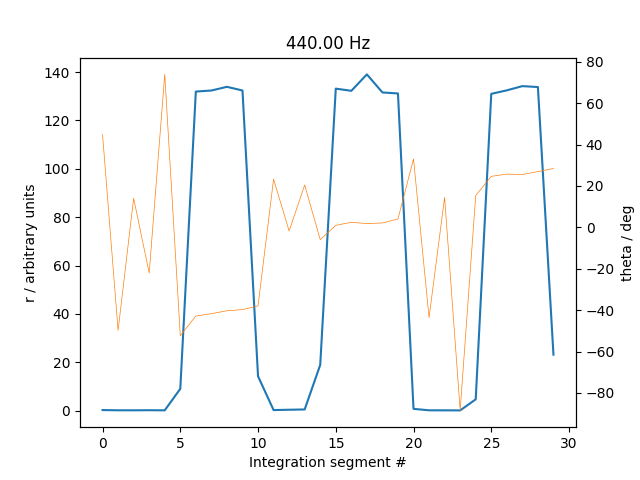

Lock-in amplifier
=================

## Example

Example of a WAV file where a (strong) 440 Hz sound is present for five seconds in three periods.

The analysis shows that the sound can be filtered out very well with a lock-in frequency of 440 Hz. Theta angle varies from period to period – which means the sound is not in phase over the three different periods.
